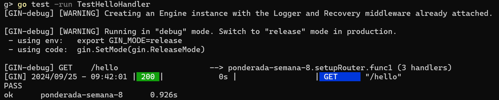
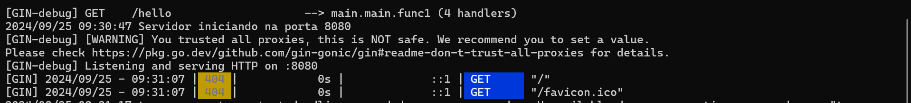

# ponderada-semana-8-prog

Este repositório contém um exemplo de implementação do OpenTelemetry em uma aplicação Go. A aplicação usa OpenTelemetry para rastrear requisições HTTP, facilitando o monitoramento e depuração de sistemas distribuídos.

## Passos para Executar o Exemplo

### Clonar o Repositório:
Clone este repositório para sua máquina local:

```bash
git clone https://github.com/yagoar45/ponderada-semana-8-prog.git
cd ponderada-semana-8-prog
```

### Instalar Dependências:

- Certifique-se de que o Go esteja instalado. Instale os módulos necessários executando:

```bash
go mod tidy
```

### Executar a Aplicação:
- Inicie o servidor com o seguinte comando:

```bash
go run main.go
```

- O servidor será iniciado na porta 8080 por padrão. Você pode acessar a instrumentação do OpenTelemetry fazendo uma requisição ao endpoint raiz:

```bash
curl http://localhost:8080
```

## Rastreamento com OpenTelemetry

### Inicialização do Tracer

- A função initTracer configura as capacidades de rastreamento do OpenTelemetry, definindo um exportador OTLP e um provedor de rastreamento. Isso permite que a aplicação envie dados de telemetria para uma plataforma de observabilidade externa.

```golang
exporter, err := otlptracehttp.New(ctx)
tp := sdktrace.NewTracerProvider(sdktrace.WithBatcher(exporter))
otel.SetTracerProvider(tp)
```

### Instrumentação de HTTP

- O exemplo utiliza o otelhttp para instrumentar automaticamente o manipulador HTTP com rastreamento. O seguinte código encapsula o helloHandler com a instrumentação do OpenTelemetry:

```golang
wrappedHandler := otelhttp.NewHandler(handler, "HelloServer")
http.Handle("/", wrappedHandler)
```
- Isso habilita o rastreamento detalhado do ciclo de vida da requisição HTTP, fornecendo insights valiosos sobre desempenho e gargalos.


### Testando a Aplicação

- Esta aplicação demonstra um cenário simples de rastreamento para requisições HTTP. Após configurar, você pode enviar requisições ao servidor e observar os dados de rastreamento capturados pelo OpenTelemetry.

- Por exemplo:

```bash
curl http://localhost:8080
```

- Isso irá gerar um span no rastreamento, mostrando o fluxo da requisição através do **helloHandler**.

## Técnicas e Conceitos (TDD)

### Desenvolvimento Orientado a Testes (TDD)

#### Testes Unitários

Os testes unitários são aplicados para garantir que cada função, como o `helloHandler`, execute corretamente. Utilizamos o pacote `net/http/httptest` para testar os manipuladores HTTP de forma isolada.

**Exemplo de Teste do `helloHandler`:**

- Verifica se a resposta da rota `/hello` é "Hello, OpenTelemetry with Gin!" e o status HTTP é 200 OK.

#### Testes de Configuração do OpenTelemetry

Testes adicionais são realizados para validar a configuração do OpenTelemetry, assegurando que o `TracerProvider` e o `TextMapPropagator` sejam corretamente inicializados e configurados.

**Exemplo de Teste de Configuração:**

- Verifica se o `TracerProvider` e o `TextMapPropagator` foram configurados corretamente.

- A aplicação segue os princípios do TDD (Test-Driven Development), garantindo que os testes guiam a implementação.
    - **Testes Unitários**: Cada função (ex: helloHandler) é testada isoladamente para garantir a execução correta antes de adicionar a instrumentação.

    - **Ciclo Red-Green-Refactor**: Os testes são escritos primeiro, seguidos pela implementação mínima de código para passar nos testes, e finalmente, o código é refatorado para maior eficiência e clareza.


### Ciclo Red-Green-Refactor

Seguindo o ciclo Red-Green-Refactor:

- **Red**: Testes são escritos primeiro para definir o comportamento esperado.
- **Green**: Implementação mínima é realizada para fazer os testes passarem.
- **Refactor**: O código é refatorado para melhorar a clareza e a eficiência, mantendo os testes passando.




## Instrumentação e Observabilidade

- O OpenTelemetry fornece observabilidade para monitorar a saúde de sistemas distribuídos. Ao adicionar rastreamento em caminhos críticos, como requisições HTTP, os desenvolvedores podem rapidamente identificar gargalos e otimizar o desempenho.

### Exemplo de Saída de Rastreamento

- Ao executar a aplicação, você pode observar rastreamentos como o seguinte:

```bash
{
    "span_id": "abc123",
    "trace_id": "xyz456",
    "attributes": {
        "handler": "hello",
        "status_code": "200"
    },
    "start_time": "2024-09-23T10:15:30.00Z",
    "end_time": "2024-09-23T10:15:32.00Z"
}
```

- Esses logs de rastreamento ajudam a acompanhar o fluxo de requisições, tempo gasto por cada manipulador e quaisquer erros encontrados durante a execução.

- na linha de comando é capturada cada requisição, como no teste abaixo:




